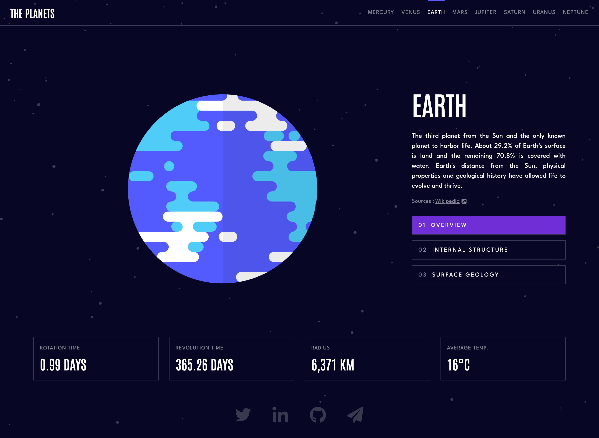
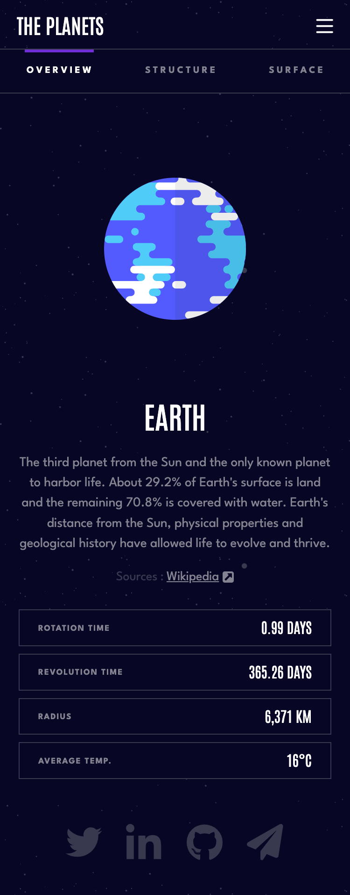

# Frontend Mentor - Planets Facts Site Solution

This is a solution to the [Planets Fact site challenge on Frontend Mentor](https://www.frontendmentor.io/challenges/planets-fact-site-gazqN8w_f). Frontend Mentor challenges help you improve your coding skills by building realistic projects.

## Table of Contents

- [Overview](#overview)
  - [The challenge](#the-challenge)
  - [Screenshots](#screenshots)
  - [Links](#links)
- [My process](#my-process)
  - [Built with](#built-with)
- [Author](#author)

## Overview

### The Challenge

Users should be able to:

- View the optimal layout for the app depending on their device's screen size
- See hover states for all interactive elements on the page
- View each planet page and toggle between "Overview", "Internal Structure", and "Surface Geology"

### Screenshots

#### Desktop

#### Mobile

### Links

- Solution URL: [https://github.com/bnielsencodes/planet-facts](https://github.com/bnielsencodes/planet-facts)
- Live Site URL: [https://bnielsen.dev/planet-facts](https://bnielsen.dev/planet-facts)

## My Process

### Built with

- Semantic HTML5 markup
- CSS custom properties
- Flexbox
- Mobile-first workflow

## Author

- Website - [Brandon Nielsen](https://www.bnielsen.dev)
- LinkedIn - [Brandon Nielsen](https://www.linkedin.com/in/bnielsencodes)
- Twitter - [@bnielsencodes](https://twitter.com/bnielsencodes)
- Frontend Mentor - [@bnielsencodes](https://www.frontendmentor.io/profile/bnielsencodes)
